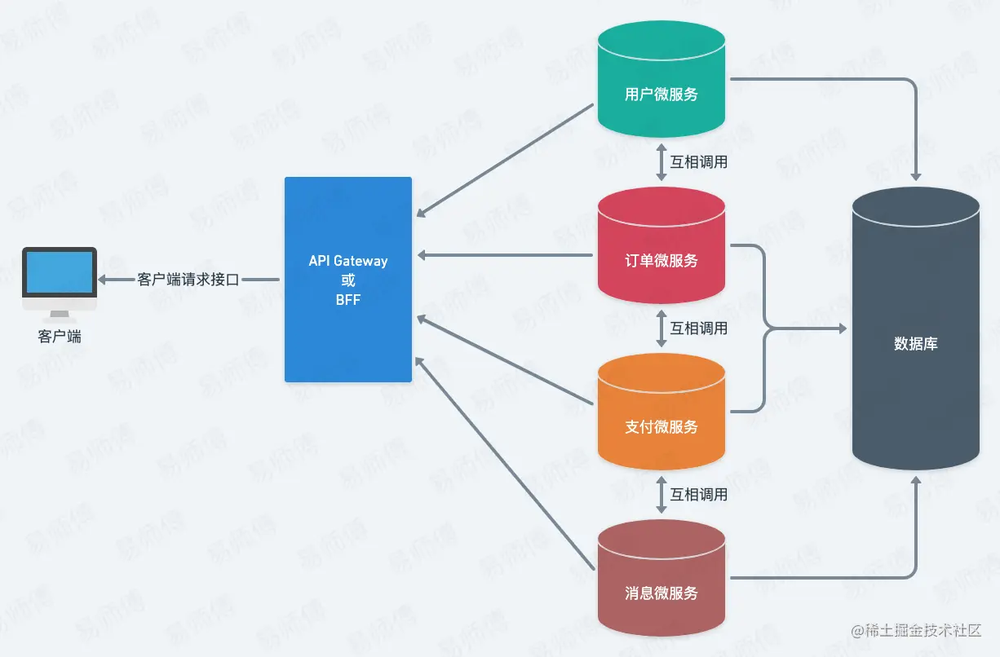
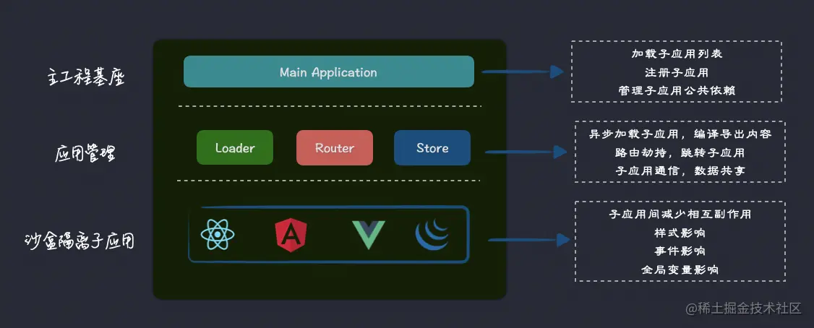

# 浅析微前端常见方案

## 什么是微前端

微前端（Micro-Frontends）是⼀种类似于微服务的架构体系，由独⽴交付的多个前端应⽤组成 
整体的架构⻛格。简单来讲就是将不同的功能，不同的维度的多个前端项⽬（⼦应⽤） 通过主应⽤ 
（基座）来聚合成⼀个整体应⽤,当路径切换时加载不同的⼦应⽤。这样各个前端应⽤都可以独⽴运 
⾏、独⽴开发、独⽴部署，选⽤不同的技术栈。

### 后端微服务架构



### 前端微前端架构



### 单体应用的痛点

在传统的单体前端应用中，随着业务的发展和功能的增加，我们经常会遇到以下问题：

- **代码库庞大**：单一代码仓库包含所有功能模块，代码量急剧增长，维护困难，且构建时间越来越长，开发体验下降
- **技术栈锁定**：整个应用必须使用统一的技术栈，难以引入新技术或升级现有技术
- **团队协作困难**：多个团队在同一个代码库中开发，容易产生代码冲突和依赖问题
- **部署风险高**：任何一个模块的变更都需要重新构建和部署整个应用，回滚和升级依赖都是问题

### 微前端的项目优势

微前端（Micro-Frontends）是一种类似于微服务的架构模式，其核心思想是**将单体前端应用拆分为多个独立的子应用**，每个子应用可以：

- **独立开发**：不同团队可以独立仓库，独立开发和管理各自负责的子应用
- **独立部署**：每个子应用可以独立构建、测试和部署
- **技术栈无关**：不同子应用可以使用不同的技术栈（React、Vue、Angular等）
- **运行时集成**：在浏览器中将多个子应用组合成一个完整的应用

蚂蚁圆桌微前端的核心价值：https://www.yuque.com/kuitos/gky7yw/rhduwc

## 微前端的关键要素

### 路由拦截及解析

通过浏览器原生提供的hashChange和popState方案，分别对于hash路由及history路由进行劫持，然后逐级解析路由地址，去加载对应路由匹配到的子项目的资源以及生成对应子应用渲染的容器。

### 资源加载

在路由解析后，获取当前匹配到的子应用的资源路径，根据当前微前端基座所用的模块化加载分案去请求子应用的对应资源，一般直接请求的是子应用打包后的app.js等入口文件

### 分配容器及子项目运行时渲染

在入口文件加载完成后，父应用会去创建对应的HTML DOM容器去承载子应用的渲染，整个过程大致如下：

1. 父应用调浏览器原生的document.createElement生成一个container;
2. 父组件去回调子组件入口文件暴露出的提前约定好的渲染函数（如乾坤的函数名叫mount,多点叫run），将生成的container作为回调函数的入参传入，具体怎么挂在和渲染由子应用自己实现，以此实现了不同技术栈的运行时集成。如Vue通过$mount挂载，React通过ReactDom.render挂载。JQ和原生则通过操作dom挂载等。

### JS隔离、CSS隔离
在经过前面3个步骤后，当前路由匹配到的子应用已经成功被挂载到了父应用所在的Index.html上下文中，这个时候就会遇到2个最常见的问题，JS全局变量的冲突（如window上挂载的函数及变量）及CSS样式的冲突。

JS的隔离方案一般是通过沙箱隔离，如乾坤的方案，代理window，给不同的子项目各自生成一个从window上拷贝下来的fake-window，在切换走的时候生成一个快照记录当前fake-window下挂载的数据和函数等，切回来的时候进行快照的还原。

CSS隔离方案一般有3种：
1. nameSpace-人为约定：如.micro-app1-xx,代表公司：多点、Single-SPA
2. 运行时劫持Dom和Css样式：在运行时对子应用打上唯一标记，并且给其下的所有后代元素加上对应属性选择器，类似于Vue的scope实现，但是要复杂的多，因为Vue是编译时实现，而当前是运行时实现，代表公司：乾坤，京东（micro-app）
3. 天然隔离，如IFrame, web-Component

### 父子应用及子应用之间的通信

- 发布订阅模式：以父项目作为派发池，各个子项目在父项目提供的消息中心去订阅和发布消息
- Iframe项目间通信使用浏览器原生提供的postMessage
- 共享存储：LocalStorage、SessionStorage

## 主流微前端实现方案对比

### iframe方案

#### 实现原理
iframe是最简单直接的微前端实现方案，通过HTML的iframe标签将不同的子应用嵌入到主应用中。

```html
<div class="micro-app-container">
  <iframe src="https://sub-app1.example.com" width="100%" height="500px"></iframe>
  <iframe src="https://sub-app2.example.com" width="100%" height="500px"></iframe>
</div>
```

#### 优点
- **实现简单**：无需复杂的技术方案，直接使用HTML标签
- **天然隔离**：iframe提供了完美的样式和JS隔离
- **技术栈无关**：子应用可以使用任意技术栈
- **独立部署**：每个子应用完全独立部署

#### 缺点
- **用户体验差**：页面刷新、前进后退按钮异常
- **性能问题**：每个iframe都是独立的浏览器上下文，内存占用大
- **通信困难**：主应用与子应用间通信复杂，需要使用postMessage
- **SEO不友好**：搜索引擎难以索引iframe内容
- **移动端兼容性**：在移动设备上可能出现滚动和布局问题

#### 适用场景
- 对用户体验要求不高的后台管理系统
- 需要集成第三方应用的场景
- 快速原型验证

### single-spa

#### 实现原理
single-spa是业界最早的微前端框架，通过路由劫持的方式实现子应用的加载和卸载。它定义了一套生命周期规范，子应用需要导出bootstrap、mount、unmount等生命周期函数。

```javascript
// 主应用配置
import { registerApplication, start } from 'single-spa';

registerApplication({
  name: 'react-app',
  app: () => System.import('react-app'),
  activeWhen: '/react',
  customProps: {}
});

registerApplication({
  name: 'vue-app', 
  app: () => System.import('vue-app'),
  activeWhen: '/vue',
  customProps: {}
});

start();

// 子应用导出生命周期
export const bootstrap = () => Promise.resolve();
export const mount = () => {
  // 挂载应用
  return Promise.resolve();
};
export const unmount = () => {
  // 卸载应用
  return Promise.resolve();
};
```

#### 优点
- **生态成熟**：作为最早的微前端框架，生态系统完善
- **框架无关**：支持React、Vue、Angular等各种框架
- **路由管理**：提供完整的路由管理方案
- **生命周期完善**：定义了清晰的应用生命周期

#### 缺点
- **学习成本高**：需要理解复杂的配置和生命周期概念
- **样式隔离问题**：需要手动处理CSS样式冲突
- **JS隔离不完善**：全局变量污染问题需要额外处理
- **子应用改造成本**：现有应用需要大量改造才能接入

#### 适用场景
- 需要精细控制子应用生命周期的场景
- 对技术栈多样性要求高的项目
- 有经验的团队进行复杂微前端架构设计

### qiankun

#### 实现原理
qiankun是阿里巴巴基于single-spa开发的微前端框架，在single-spa的基础上提供了开箱即用的API，并解决了样式隔离、JS沙箱等问题。

```javascript
// 主应用
import { registerMicroApps, start } from 'qiankun';

registerMicroApps([
  {
    name: 'react-app',
    entry: '//localhost:3000',
    container: '#subapp-viewport',
    activeRule: '/react',
  },
  {
    name: 'vue-app',
    entry: '//localhost:8080', 
    container: '#subapp-viewport',
    activeRule: '/vue',
  },
]);

start();

// 子应用导出生命周期
export async function bootstrap() {
  console.log('react app bootstraped');
}

export async function mount(props) {
  console.log('props from main framework', props);
  render(props);
}

export async function unmount(props) {
  const { container } = props;
  ReactDOM.unmountComponentAtNode(container);
}
```

#### 优点
- **开箱即用**：提供完整的微前端解决方案，配置简单
- **样式隔离**：自动处理CSS样式隔离问题
- **JS沙箱**：提供多种JS隔离方案，防止全局变量污染
- **资源预加载**：支持子应用资源预加载，提升用户体验
- **通信机制**：提供简单易用的应用间通信方案

#### 缺点
- **基于single-spa**：继承了single-spa的一些限制
- **构建工具依赖**：对webpack等构建工具有一定要求
- **调试复杂**：多应用运行时调试相对复杂
- **版本兼容性**：不同版本间可能存在兼容性问题

#### 适用场景
- 需要快速实现微前端架构的项目
- 对样式隔离和JS沙箱有要求的场景
- 中大型企业级应用

### Webpack Module Federation

#### 实现原理
Module Federation是Webpack 5引入的新特性，允许多个独立的构建之间共享模块。它通过运行时动态加载的方式实现微前端。

```javascript
// webpack.config.js - 主应用
const ModuleFederationPlugin = require('@module-federation/webpack');

module.exports = {
  plugins: [
    new ModuleFederationPlugin({
      name: 'shell',
      remotes: {
        mfReact: 'mfReact@http://localhost:3001/remoteEntry.js',
        mfVue: 'mfVue@http://localhost:3002/remoteEntry.js',
      },
    }),
  ],
};

// webpack.config.js - 子应用
module.exports = {
  plugins: [
    new ModuleFederationPlugin({
      name: 'mfReact',
      filename: 'remoteEntry.js',
      exposes: {
        './App': './src/App',
      },
    }),
  ],
};

// 主应用中使用
const RemoteApp = React.lazy(() => import('mfReact/App'));
```

#### 优点
- **原生支持**：Webpack 5原生支持，无需额外框架
- **模块级共享**：可以在模块级别进行共享，粒度更细
- **依赖共享**：可以共享公共依赖，减少重复加载
- **类型安全**：支持TypeScript类型共享
- **构建时优化**：在构建时进行优化，运行时性能好

#### 缺点
- **Webpack依赖**：强依赖Webpack 5，技术栈限制
- **配置复杂**：复杂项目的配置相对复杂
- **调试困难**：跨应用调试比较困难
- **版本管理**：依赖版本管理需要特别注意

#### 适用场景
- 使用Webpack 5的项目
- 需要细粒度模块共享的场景
- 对构建性能有要求的项目

### Web Components

#### 实现原理
Web Components 是浏览器原生提供的组件化解决方案，基于四个核心技术：Custom Elements（自定义元素）、Shadow DOM（影子DOM）、HTML Templates（HTML模板）和 HTML Imports（已废弃）。通过这些技术可以创建封装性良好的自定义元素，实现微前端架构。

```javascript
// 主应用 - 定义微前端容器组件
class MicroFrontendApp extends HTMLElement {
  constructor() {
    super();
    // 创建 Shadow DOM，实现样式和 DOM 隔离
    this.attachShadow({ mode: 'open' });
  }
  
  connectedCallback() {
    const appUrl = this.getAttribute('app-url');
    const appName = this.getAttribute('app-name');
    
    this.shadowRoot.innerHTML = `
      <style>
        :host {
          display: block;
          width: 100%;
          height: 100%;
        }
        .loading {
          display: flex;
          justify-content: center;
          align-items: center;
          height: 200px;
        }
        .error {
          color: red;
          text-align: center;
        }
      </style>
      <div class="micro-app-container">
        <div class="loading">加载中...</div>
      </div>
    `;
    
    this.loadMicroApp(appUrl, appName);
  }
  
  async loadMicroApp(appUrl, appName) {
    try {
      // 动态加载子应用的入口文件
      const response = await fetch(`${appUrl}/manifest.json`);
      const manifest = await response.json();
      
      // 加载子应用的 JS 和 CSS
      await this.loadResources(appUrl, manifest);
      
      // 渲染子应用
      const container = this.shadowRoot.querySelector('.micro-app-container');
      container.innerHTML = '<div id="micro-app-root"></div>';
      
      // 调用子应用的渲染方法
      if (window[appName] && window[appName].render) {
        window[appName].render(container.querySelector('#micro-app-root'));
      }
    } catch (error) {
      this.shadowRoot.querySelector('.micro-app-container').innerHTML = 
        `<div class="error">加载失败: ${error.message}</div>`;
    }
  }
  
  async loadResources(baseUrl, manifest) {
    // 加载 CSS
    for (const css of manifest.css || []) {
      const link = document.createElement('link');
      link.rel = 'stylesheet';
      link.href = `${baseUrl}/${css}`;
      this.shadowRoot.appendChild(link);
    }
    
    // 加载 JS
    for (const js of manifest.js || []) {
      await this.loadScript(`${baseUrl}/${js}`);
    }
  }
  
  loadScript(src) {
    return new Promise((resolve, reject) => {
      const script = document.createElement('script');
      script.src = src;
      script.onload = resolve;
      script.onerror = reject;
      document.head.appendChild(script);
    });
  }
  
  disconnectedCallback() {
    // 清理子应用
    const appName = this.getAttribute('app-name');
    if (window[appName] && window[appName].unmount) {
      window[appName].unmount();
    }
  }
}

// 注册自定义元素
customElements.define('micro-frontend-app', MicroFrontendApp);

// 子应用 - React 应用示例
// sub-app/src/index.js
import React from 'react';
import ReactDOM from 'react-dom';
import App from './App';

// 导出渲染和卸载方法供主应用调用
window.ReactSubApp = {
  render(container) {
    ReactDOM.render(<App />, container);
  },
  
  unmount(container) {
    ReactDOM.unmountComponentAtNode(container);
  }
};

// 子应用的 manifest.json
{
  "name": "react-sub-app",
  "version": "1.0.0",
  "css": ["static/css/main.css"],
  "js": ["static/js/main.js"]
}

// 主应用中使用
<micro-frontend-app 
  app-url="http://localhost:3001" 
  app-name="ReactSubApp">
</micro-frontend-app>

<micro-frontend-app 
  app-url="http://localhost:3002" 
  app-name="VueSubApp">
</micro-frontend-app>
```

#### 优点
- **浏览器原生**：基于 Web 标准，无需额外框架依赖
- **天然隔离**：Shadow DOM 提供完美的样式和 DOM 隔离
- **标准化**：遵循 Web 标准，具有长期稳定性
- **轻量级**：无需引入额外的微前端框架代码
- **技术栈无关**：子应用可以使用任意技术栈开发

#### 缺点
- **浏览器兼容性**：IE 不支持，需要 polyfill
- **生态不成熟**：相关工具和最佳实践还在发展中
- **开发体验**：调试工具和开发工具支持相对较少
- **通信复杂**：跨 Shadow DOM 的组件通信相对复杂

#### 适用场景
- 对浏览器兼容性要求不高的现代 Web 应用
- 希望使用原生 Web 标准的项目
- 需要强隔离性的微前端场景
- 轻量级微前端解决方案
- **学习成本**：需要学习Web Components相关标准

#### 适用场景
- 对浏览器兼容性要求不高的现代应用
- 希望使用Web标准的项目
- 需要长期稳定性的场景


