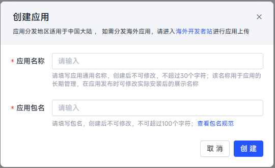
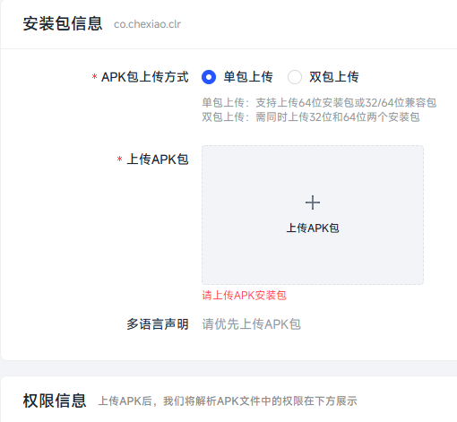
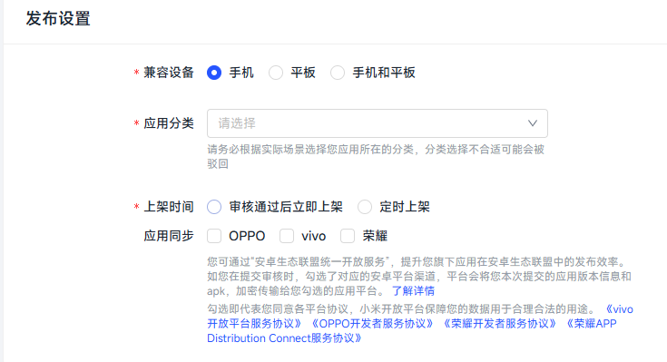
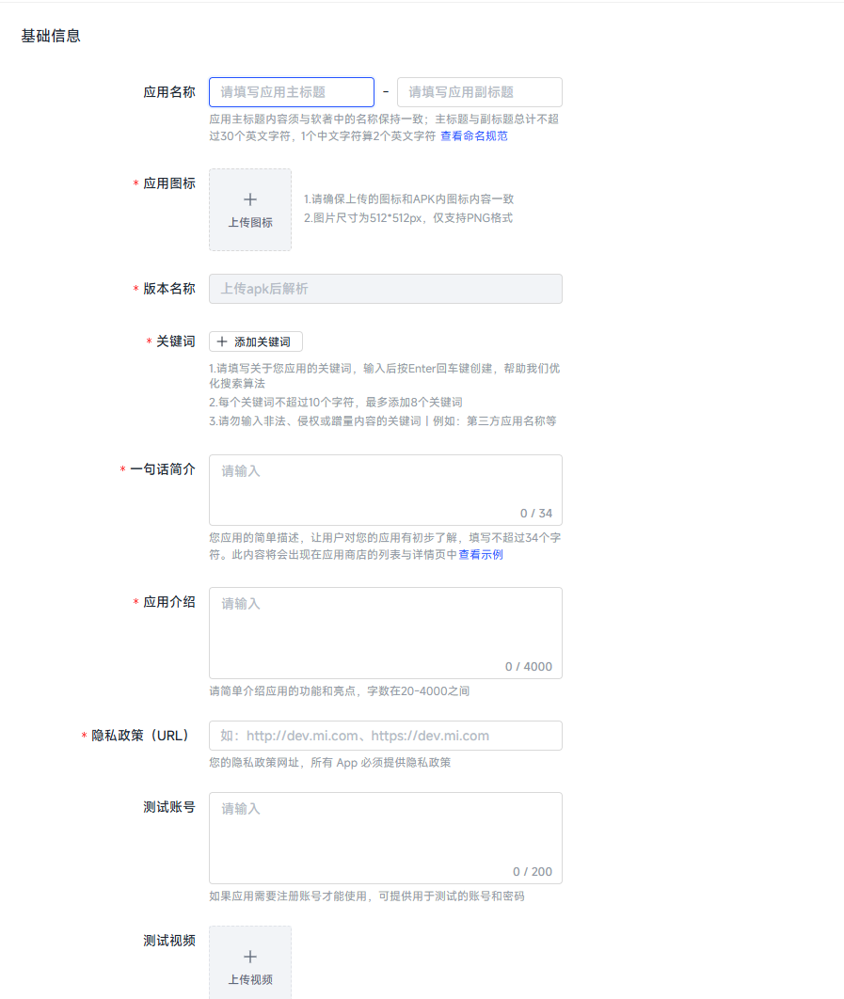
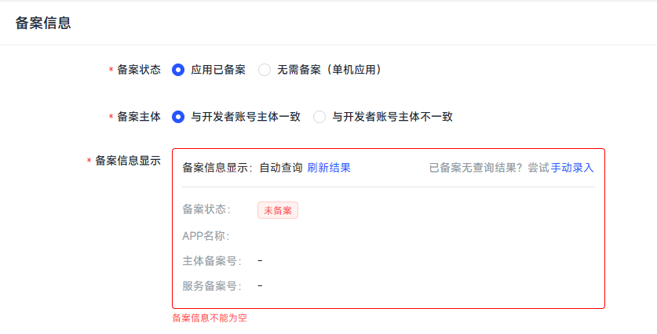
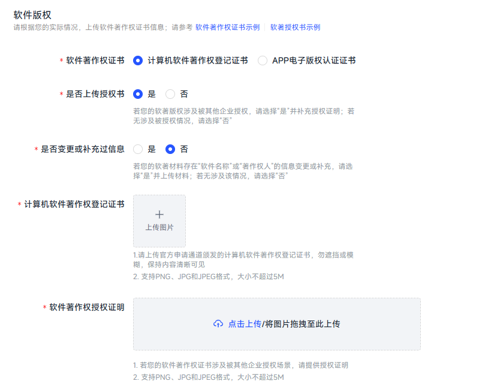
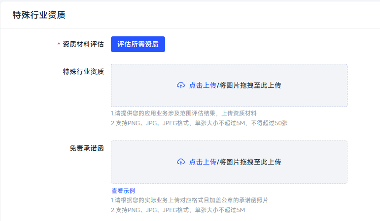
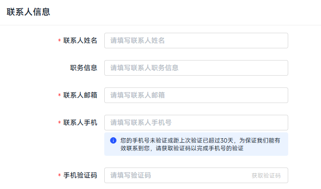

# APP 上架各应用市场流程

## 核心流程

各个平台的上架流程基本一致，都分为以下几个节点：

**1.材料准备** **2.创建开发者账号** **3.创建上架应用** **4.提交审核** **5.完成上架**

## 材料准备

材料准备是最重要的一个环节，如果材料准备充分，后续的所有步骤都只是走流程，如果材料有缺失，建议先准备材料，否则后续做的都是无用功

### 1.应用材料

- 开发完成的 APK 包（32 位包，64 位包，或者 1 个包支持 32，64 位），并且完成签名和加固
- APP 名称、包名、及相关介绍（50-100 字）
- APP 图标及相关功能页面截图
- 隐私采集协议，需要准备 word 文档版及静态网页版（需要部署到服务器，保证随时可访问）
- 注意包名和应用名称，后续会在软著，备案，上架都会用到，并且不可修改！

### 2.公司材料

- 营业执照、组织机构代码（三证合一的只需要营业执照）
- 企业法人身份证正反面、法人手持身份证照片

### 3.隐私采集协议

- APP 的开屏页（进入功能页面前）需要弹窗展示隐私采集协议
- 需要准备隐私采集协议的 word 版本，后续其他流程会用到
- 隐私采集协议还需要单独写一个静态页面，需要部署到服务器，随时能访问到
- 注意，上面提到的所有涉及到隐私协议的地方，隐私协议内容需要保持一致，不然后续审批会驳回

### 4.特殊行业资质

如果 APP 上架的类目涉及到特殊行业，如金融类，医疗类，政府类等，需要前置准备国家批复的相关文件，否则后续是很难通过 APP 备案及上架审核的

### 5.APP 软著或电子版权证明（2 选 1）

- APP 软著是由国家版权局批复，审核时间比较长，通常为 30-60 个工作日，且审核相对严格
- 电子版权证明可由三方代理机构办理，一般 1-2 周可拿证，审核相对宽松，如果只是上架 APP，建议选择这个
- 需要提供的申请材料一般包括以下内容
  - 第一步提到的应用材料
  - 部分源码（1000 行左右）
  - 产品说明书
  - 版权方信息，个人或者企业信息

### 6. APP 工信部备案及对应后端服务器域名的 ICP 备案

根据国家最新的信息安全规定，所有上架的 APP 都必须在国家工信部进行备案，如果没通过备案的 APP，在各大应用市场都是无法上架的。开发者可以通过各个云平台去进行备案，在此以阿里云为例。总体流程为：1.注册阿里云账号及企业认证 2.购买云服务器及域名 3.填写备案资料 4.阿里云备案初审 5.国家工信部短信核验 6.工信部备案审核

- 注册阿里云账号：在[阿里云官网](https://www.aliyun.com/),正常注册即可，注册手机号和邮箱无需是公司法人
- 阿里云企业认证：在注册完账号后，找到企业认证入口，上传营业执照，通过法人人脸识别即可完成企业认证
- 购买云服务器及域名：这里可以根据实际情况选择合适的服务器及域名，注意域名 ICP 备案的主体需要和 APP 备案时的主体一致
- 填写备案资料：在阿里云中找到对应备案入口=》我的备案=》开始备案，如果前面 5 步的材料都准备好了的话，依次填写材料即可，过程中需要法人配合。
- 备案过程中可能会涉及到 APK 的公钥模数和 MD5 签名，这个通过反编译工具如[JADX-GUI](https://github.com/skylot/jadx)将打包好的 APK 去反编译即可获取

## 创建开发者账号

在确定应用需要上架的市场后，就需要到对应的应用市场去创建开发者账号，目前大部分应用市场已经不支持个人开发者注册上架，注册开发者账号都需要以企业为单位去注册。各个应用市场注册账号的流程都大同小异，本文拿小米应用市场举例。

### 1.账号注册

[小米开发者中心](https://dev.mi.com/xiaomihyperos/console/developer/info),点击注册，填写手机号和验证码后即注册成功，这里的手机号无需是公司法人的手机号

### 2.企业认证

在后台系统中找到企业认证，填写公司名称，上传三证合一的营业执照，填写联系人信息（姓名，邮箱，手机号），联系人无需是公司法人。在填写完成后，需要公司法人进行二维码扫描，进行人脸识别认证，认证成功后即通过企业认证。有些应用市场是以对公转账的形式来进行企业认证

## 创建上架应用

### 创建应用

当开发者账号注册完成，并且完成企业认证后，即可到管理中心开始创建待上架的应用

注意，这里的包名和应用名称，创建后无法修改，请根据 APK 打包时候的包名和应用名称准确填写

## 提交审核

### 1.安装包信息

该步骤主要包括，上传 APK 包（这里需要将 APK 进行 V1 签名，可以使用 android studio 中的 apkSigner 插件进行签名）

### 2.发布设置

该步骤主要选择兼容设备类型，应用所在分类，上架时间，以及需要同步上传的应用市场

### 3.基础信息

填写应用相关的信息即可，其中隐私政策，即为上文中提到的需要单独部署的 H5 页面链接来展示隐私收集协议

### 4.备案信息

该信息无需手动填写，小米应用市场会根据你的应用包名和名称去工信部自动查询，如果你已经完成材料准备中的 APP 备案，这里自动会通过，注意备案的包名和你当前创建的包名得完全一致

### 5.基础资质

这里需要将材料准备中的软著或电子版权证明进行上传，如果软著持有的公司和当前上架的公司主体不一致，需要额外下载软著授权书模板，完善盖章后在此上传

### 6.特殊行业资质

该步骤中需要根据 APP 所在应用分类进行资质评估，如果是特殊行业（如金融，医疗，政府等）需要提供对应的资质，如贷款类，需要提供小额贷款拍照，保险类需要提供保险类牌照

### 7.联系人信息

正常填写联系人信息即可，无需是公司法人

在完成上述内容后，即可点击提交审核，开始提审，一般审核时间为 4-24 小时，如果被驳回会有详细的驳回原因，按照对应的原因处理即可，有任何疑问可以联系平台人工客服

## 完成上架

- 当审核通过后，如果你前面选择的审核通过立即上架，则自动上架成功，否则需要手动去点击上架
- 如果前面勾选了同步到 oppo,vivo,荣耀等平台的话，小米应用市场会将审核数据同步到对应平台，进行审核，如果通过的话，也会同步上架
